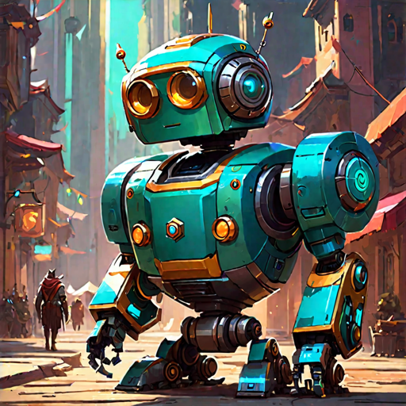

=======================================================

THIS IS AN UNFINISHED PROJECT.
I'M REWRITING IT. WIP

=======================================================
# Funky Game BOT Specs
 
## Step 0
The player wants to start a game (with the bot). 

## Step 1
The bot gives the player an address to send funds to.
You / and whoever you like get a notification on a private channel along the privatekey (if each game has a new address).

The bot waits for x minutes for funds to arrive.

## Step 2
IF the player send the funds in time, the bot tells the player to pick his hand.

IF the player did not send the fund in time (but later) the bot will notify the player and ask him TO NOT SEND THE FUNDS.
+ send back the player his money (with a small fee possibly) (if it is sent to the address).

## Step 3
The bot brodcast in channel and in DM that a game is ready and open (for the agreed upon deadline).

## Step 4
Player 2 can join the game by messaging the bot with the game ID, and his hand.

The player than needs to send the funds to the bot address for that game (or the bot address if there is only one).

((We need to resolve a conflict here, if multiple people play the game at the same time)), the bot will monitor these cases.

## Step 5
The bot updates the broadcast message and says the game is resolved.
Also shows the first 4 and last 4 hexadecimal symbols of the winners address.

## Step 6
The bot notifies the winner in DM.
The bot sends the winner his funds.
The 5% (game fee) can stay in the same address OR can be sent to another address if you like.

-------

